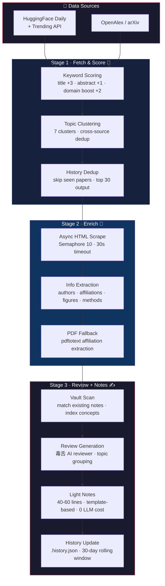
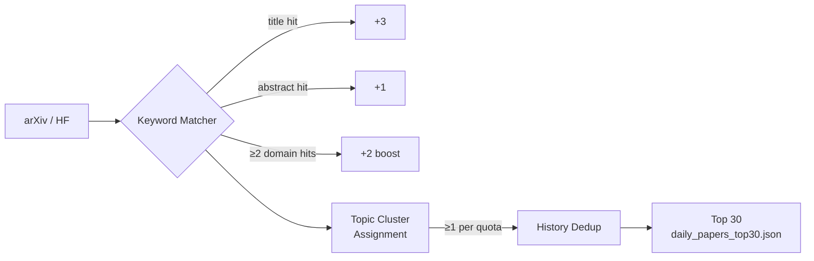
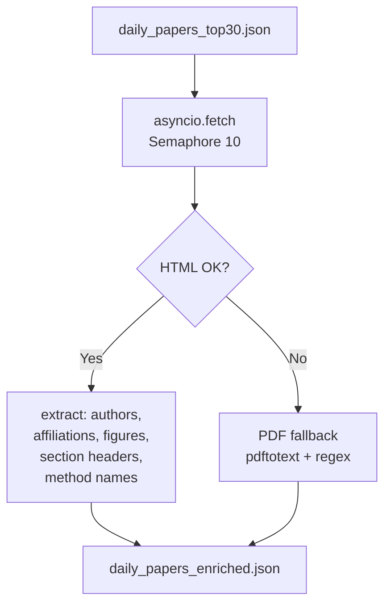
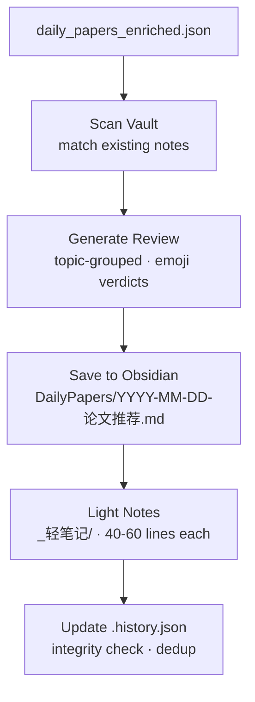

<p align="center">
  
  
  
  
</p>

<div align="center">
  <h1>📡 Daily Papers Pipeline</h1>
  <p><strong>从海量论文中，抓出你真正关心的那几篇</strong></p>
  <p>3-stage pipeline · keyword scoring · topic clustering · AI review · Obsidian integration</p>
</div>

---

## 🎯 一句话

每天早上一句话 —— **「今日论文推荐」** —— 自动抓取 HuggingFace + arXiv 最新论文，按你的研究方向打分筛选，生成带态度的毒舌点评，保存到 Obsidian。

---

## 🔄 Pipeline



---

## 📦 项目结构

```
daily-papers-pipeline/
│
├── _shared/                          # 共享配置层
│   ├── user-config.json              #   关键词 · 聚类 · 路径 · 阈值
│   ├── user-preferences.md           #   研究方向偏好（核心/兴趣/过滤）
│   ├── user_config.py                #   深度合并加载器
│   ├── generate_concept_mocs.py      #   概念目录页生成器
│   ├── generate_paper_mocs.py        #   论文目录页生成器
│   └── moc_builder.py                #   目录页构建引擎
│
├── daily-papers/                     # 核心脚本
│   ├── fetch_and_score.py            #   抓取 + 打分 + 聚类 + 去重（主力）
│   ├── enrich_papers.py              #   异步富化（HTML + PDF fallback）
│   ├── extract_affiliations.py       #   PDF 机构提取
│   ├── parse_arxiv.py                #   arXiv ID 解析
│   └── download_note_images.py       #   笔记图片下载
│
├── daily-papers-fetch/               # Claude Code Skill
├── daily-papers-review/              # Claude Code Skill
├── daily-papers-notes/               # Claude Code Skill
├── daily-papers/                     # Claude Code Skill（总入口）
├── generate-mocs/                    # Claude Code Skill
│
└── SKILL.md                          # 每套 Skill 的自述文件
```

---

## ⚙️ 工作流详解

### Stage 1 · 抓取 + 打分



| 机制 | 细节 |
|------|------|
| **来源** | HuggingFace Daily + Trending API · OpenAlex (arXiv 关键词检索) |
| **负向过滤** | 36 个负向关键词 —— 医学、天气、语音、OCR、金融交易、GUI agent、RAG …… 直接跳过 |
| **聚类** | 7 个话题簇，每篇论文自动归属得分最高的簇，支持交叉簇 |
| **配额兜底** | GPU Inference/Serving 和 Agent Architecture 两个方向**至少各 1 篇** |
| **历史去重** | 读取 `.history.json`，已推论文不再出现。30 天滚动窗口 |
| **周末策略** | arXiv 周末不更新，HF Daily 基本为空 —— 自动切换 to HF Trending |

### Stage 2 · 富化

抓取 HTML 页面 + PDF fallback，纯 regex 解析，**零 LLM 消耗**：



### Stage 3 · 点评 + 笔记

富化数据 → 毒舌点评 → Obsidian 落盘：



**点评人设**：毒舌但眼光极准的 AI 审稿人。每条点评末尾一个 emoji 判决：

| 标签 | 含义 |
|------|------|
| 🔥 | 强推 / 有真东西 |
| 👀 | 值得关注 / 有意思 |
| ⚠️ | 有硬伤但方向对 |
| 🫠 | 一般般 / incremental |
| 💀 | 灌水 / 没什么价值 |
| 🤡 | 标题党 / 夸大其词 |
| 💤 | 无聊 / 无关 |

> 每篇论文必须找到至少一个值得质疑的点。不和不存在的 reviewers 和稀泥。

---

## 🔧 配置

### `_shared/user-config.json` —— 主配置

```json
{
  "daily_papers": {
    "keywords": ["world model", "llm inference", "agent architecture", ...],
    "negative_keywords": ["medical", "weather", "speech", "ocr", ...],
    "topic_clusters": {
      "B2_GPU_Inference": { "label": "GPU Inference / Serving", "keywords": [...] },
      "A4_Agentic_Design": { "label": "Agent Architecture", "keywords": [...] },
      ...
    },
    "min_score": 2,
    "top_n": 30
  }
}
```

### `_shared/user-preferences.md` —— 研究方向偏好

轻量级 markdown，定义**核心方向**（高优先级）和**兴趣方向**（低优先级），review 阶段按此筛选论文，与研究方向无关的直接跳过。

---

## 🚀 使用方式

通过 Claude Code Skills 触发，一句话搞定：

| 你说 | 它做 |
|------|------|
| **「今日论文推荐」** | 跑完整流水线（抓取 → 富化 → 点评 → 笔记 → 历史更新） |
| **「跑一下论文抓取」** | 只抓取 + 富化，不生成点评 |
| **「跑一下论文点评」** | 基于已富化的数据生成点评 |
| **「跑一下论文笔记」** | 为必读论文生成深度笔记，回填链接 |
| **「精读 1,3,5」** | 选择指定论文生成完整深笔记 |

---

## 🧠 设计原则

```
┌─────────────────────────────────────────────────────┐
│                                                    │
│  零 API Key    免费接口 · 开箱即用                    │
│  零 Token 浪费  打分/聚类纯 Python · LLM 仅用于点评    │
│  幂等安全       轻笔记覆盖写入 · 历史去重保不重复        │
│  Git 友好       Markdown + JSON · 天然可 diff         │
│  低心智负担     一句话触发 · 每天 5 分钟                │
│                                                    │
└─────────────────────────────────────────────────────┘
```

---

## 📋 依赖

- Python 3.10+
- `curl`（富化阶段 HTML 抓取）
- `pdftotext`（可选，PDF 机构提取）
- [Obsidian](https://obsidian.md/) 笔记库（输出目标）

---

<p align="center">
  <sub>Built with ❤️ for researchers who'd rather read papers than hunt for them.</sub>
</p>
